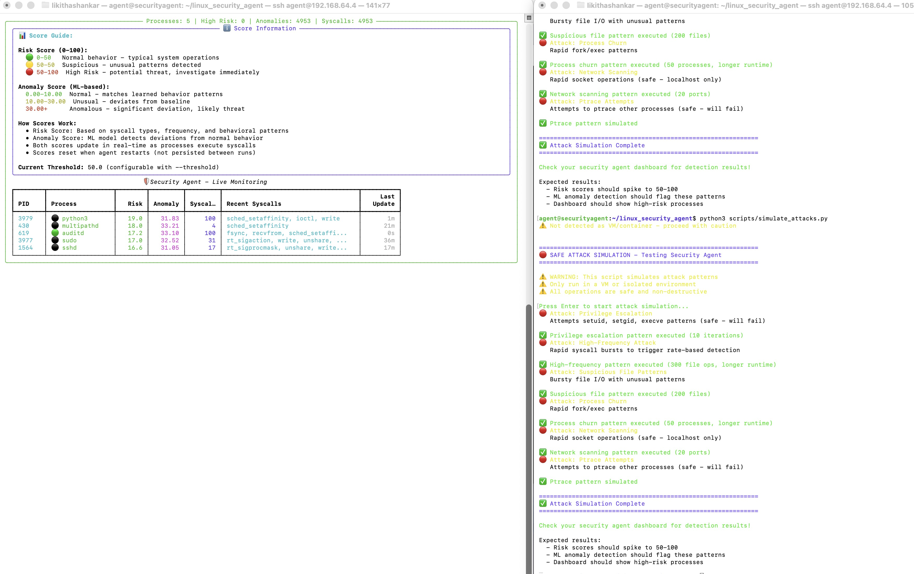

# Linux Security Agent

> **Author**: Likitha Shankar  
> **Purpose**: Academic research project demonstrating eBPF-based syscall monitoring and ML anomaly detection

Real-time system call monitoring and threat detection agent for Linux. Uses eBPF to capture syscalls from the kernel and ML to detect anomalies. This project was developed as part of a Master's degree program to explore kernel-level security monitoring and machine learning-based threat detection.

**Status:** Functional Prototype - Research/Academic Project  
**Classification:** Not Production Ready - See [docs/PROJECT_STATUS.md](docs/PROJECT_STATUS.md) for details

**Recent fixes:**
- Now captures actual syscall names (333 mapped) instead of just counting
- ML trains on real system behavior instead of random data
- Added automatic memory cleanup to prevent leaks
- Fixed thread safety issues
- Improved container detection for Docker

## Features

- Real-time syscall monitoring via eBPF on Linux
- ML-based anomaly detection trained on real system behavior
- **Automatic incremental retraining** - Models continuously improve with new data
- Risk scoring (0-100) based on syscall patterns
- Process tracking with automatic memory cleanup
- Container detection for Docker and Kubernetes
- Real-time dashboard showing risk scores and syscalls
- Cross-platform support (Linux with eBPF, macOS simulation)
- JSON and console output formats
- Demo scripts for testing

## Research Features

Implements ideas from recent research:

**Stateful eBPF Monitoring** - Based on "Programmable System Call Security with eBPF" (2023)
- Tracks process state across system calls
- Dynamic policies that update at runtime
- Beyond basic seccomp filtering

**Unsupervised Anomaly Detection** - Based on U-SCAD research (2024)
- Uses multiple ML algorithms (Isolation Forest, One-Class SVM, DBSCAN)
- Learns normal behavior automatically
- Ensemble approach for better detection

**Container-Aware Security** - Based on "Cross Container Attacks" research (2023)
- Detects which container processes belong to
- Prevents cross-container attacks
- Container-specific policies
- Docker integration

## Installation

```bash
git clone https://github.com/likitha-shankar/Linux-Security-Agent.git
cd Linux-Security-Agent

# Create virtual environment
python3 -m venv venv
source venv/bin/activate

# Install dependencies
pip install -r requirements.txt
```

### Linux (with Enhanced eBPF support)
```bash
# On Ubuntu/Debian:
sudo apt-get install bpfcc-tools python3-bpfcc docker.io

# On CentOS/RHEL:
sudo yum install bcc-tools python3-bcc docker

# Install additional ML dependencies
pip install scikit-learn pandas numpy
```

### macOS (simulation mode)
```bash
# Install dependencies for enhanced features
pip install scikit-learn pandas numpy docker
```

### Enhanced Features Setup
```bash
# Install Docker for container security monitoring
sudo systemctl start docker
sudo systemctl enable docker
sudo usermod -aG docker $USER
newgrp docker

# Verify enhanced components
python3 -c "from core.enhanced_ebpf_monitor import StatefulEBPFMonitor; print('✅ Enhanced eBPF monitor available')"
python3 -c "from core.enhanced_anomaly_detector import EnhancedAnomalyDetector; print('✅ Enhanced anomaly detector available')"
python3 -c "from core.container_security_monitor import ContainerSecurityMonitor; print('✅ Container security monitor available')"
```

## Usage

### Option 1: Simple Agent (Recommended for Testing)
```bash
# Run simple agent with auditd (most reliable)
sudo python3 core/simple_agent.py --collector auditd --threshold 30

# Or with eBPF
sudo python3 core/simple_agent.py --collector ebpf --threshold 30
```

**Benefits:**
- ✅ Upfront system validation with clear error messages
- ✅ Automatic collector fallback
- ✅ Clean, working dashboard
- ✅ Easy to debug

### Option 2: Enhanced Agent (Full Features)
```bash
# Run the enhanced agent with dashboard
sudo python3 core/enhanced_security_agent.py --dashboard --threshold 30
```

### Collector selection (eBPF default, auditd fallback)
```bash
# eBPF (default, recommended if available)
sudo python3 core/enhanced_security_agent.py --collector ebpf --dashboard

# Auditd (fallback, most reliable if eBPF unavailable)
sudo python3 core/enhanced_security_agent.py --collector auditd --dashboard
```

### With training
```bash
# Train models first on real data
python3 core/enhanced_security_agent.py --train-models

# Then run monitoring
sudo python3 core/enhanced_security_agent.py --dashboard

# Append to previous feature store when retraining
python3 core/enhanced_security_agent.py --train-models --append
```

### Other options
```bash
# JSON output
sudo python3 core/enhanced_security_agent.py --output json --timeout 60

# With timeout (auto-stop)
sudo python3 core/enhanced_security_agent.py --dashboard --timeout 30

# Compact TUI (table-only) instead of full dashboard
sudo python3 core/enhanced_security_agent.py --tui --timeout 60
```

## Configuration (config.yml)

Place a YAML (or JSON) config at `config/config.yml` (auto-loaded) or pass via `--config path/to/file`. Example:
```yaml
risk_threshold: 50.0
anomaly_weight: 0.5
decay_factor: 0.95
decay_interval: 60
collector: ebpf
base_risk_scores:
  ptrace: 10
  setuid: 8
  execve: 5
  mount: 4
```

## 🧪 Demo and Testing

```bash
# Run comprehensive demo (normal + suspicious behavior)
python3 demo/run_demo.py

# Run individual demos
python3 demo/normal_behavior.py
python3 demo/suspicious_behavior.py

# Run test suite
python3 run_tests.py
```

## 📊 Current Progress & Demo



**Live Monitoring Dashboard** showing:
- Real-time process monitoring with risk and anomaly scores
- Score information panel explaining risk (0-100) and anomaly (0-100) thresholds
- Attack simulation results demonstrating detection capabilities
- Status indicators (🟢 active, ⚪ recent, ⚫ inactive)

**Example Output:**

```
╭───────────────────────────── Processes: 5 | High Risk: 0 | Anomalies: 4953 | Syscalls: 4953 ─────────────────────────────╮
│ 🛡️ Security Agent - Live Monitoring                                                                                      │
│ ┏━━━━━━┳━━━━━━━━━━━━━━━━┳━━━━━━┳━━━━━━━━━┳━━━━━━━━━━┳━━━━━━━━━━━━━━━━━━━━━━━━━━━━━━━━━━━━━━━━━━━━━━━━━━━━━━━━━━━━━━━━━━━━│
│ ┃ PID  ┃ Process        ┃ Risk ┃ Anomaly ┃ Syscalls ┃ Recent Syscalls                                     ┃ Last Update  │
│ ┡━━━━━━╇━━━━━━━━━━━━━━━━╇━━━━━━╇━━━━━━━━━╇━━━━━━━━━━╇━━━━━━━━━━━━━━━━━━━━━━━━━━━━━━━━━━━━━━━━━━━━━━━━━━━━━━━━━━━━━━━━━━━━│
│ │ 3979 │ 🟢 python3     │ 19.0 │ 31.83   │ 100      │ sched_setaffinity, ioctl, write                     │      1m      │
│ │ 430  │ ⚪ multipathd  │ 18.0 │ 33.21   │ 4        │ sched_setaffinity                                   │      21m     │
│ │ 619  │ 🟢 auditd      │ 17.2 │ 33.10   │ 100      │ fsync, recvfrom, sched_setaffinity                  │      0s      │
│ │ 3977 │ ⚪ sudo        │ 17.0 │ 32.52   │ 31       │ rt_sigaction, write, unshare                        │      36m     │
│ │ 1564 │ ⚪ sshd        │ 16.6 │ 31.05   │ 17       │ rt_sigprocmask, unshare, write                      │      17m     │
│ └──────┴────────────────┴──────┴─────────┴──────────┴─────────────────────────────────────────────────────┴──────────────┘
```

**Score Guide:**
- **Risk Score (0-100)**: 🟢 0-30 Normal | 🟡 30-50 Suspicious | 🔴 50+ High Risk
- **Anomaly Score (0-100)**: 🟢 0-10 Normal | 🟡 10-30 Unusual | 🔴 30+ Anomalous

## Research Contribution

This implements ideas from recent research papers:
- "Programmable System Call Security with eBPF" (2023) - eBPF monitoring
- "U-SCAD: Unsupervised System Call-Driven Anomaly Detection" (2024) - ML detection
- "Cross Container Attacks" (2023) - Container security

### What's Implemented

The system includes:
- Real-time syscall capture from kernel via eBPF (333 syscalls mapped) with auditd fallback
- ML anomaly detection trained on actual system behavior (Isolation Forest, One-Class SVM, DBSCAN)
- Modular architecture with collector factory pattern
- Thread-safe process tracking with proper locking
- Automatic memory cleanup
- Container detection for Docker/Kubernetes
- Risk scoring from real syscall patterns with ML anomaly integration
- Real-time dashboard with process monitoring
- Attack simulation scripts for testing

See [docs/PROJECT_STATUS.md](docs/PROJECT_STATUS.md) for detailed status and [docs/GAP_ANALYSIS.md](docs/GAP_ANALYSIS.md) for known limitations.

## Requirements

### Linux
- Linux kernel 4.1 or higher
- Root privileges (for eBPF)
- Python 3.7+
- BCC tools (install with: sudo apt-get install bpfcc-tools python3-bpfcc)

### macOS
- macOS 10.14+
- Python 3.7+
- No root needed (uses simulation mode)

## Troubleshooting

If you get import errors:
```bash
pip install requests>=2.28.0
pip install psutil>=5.8.0
```

Permission errors on Linux - need to run with sudo for eBPF. On macOS it works without sudo.

## 🏗️ Architecture

> **📊 For detailed visual architecture diagrams, see [docs/ARCHITECTURE_DIAGRAMS.md](docs/ARCHITECTURE_DIAGRAMS.md)**

### **Core Components**
- **SecurityAgent**: Main orchestrator and eBPF integration
- **MacSecurityAgent**: macOS-compatible version with simulation
- **SyscallRiskScorer**: Risk scoring algorithm
- **ProcessMonitor**: Process tracking and updates
- **AnomalyDetector**: ML-based anomaly detection
- **ActionHandler**: Automated response system
- **Dashboard**: Real-time TUI visualization

### **Enhanced Components (Research-Based)**
- **EnhancedSecurityAgent**: Main orchestrator with all research enhancements
- **StatefulEBPFMonitor**: Stateful eBPF monitoring with programmable policies
- **EnhancedAnomalyDetector**: Multi-algorithm ensemble anomaly detection
- **ContainerSecurityMonitor**: Container-aware security with cross-container attack prevention
- **EnhancedRiskScorer**: Behavioral baselining and adaptive risk scoring

### **Project Structure**
```
Linux-Security-Agent/
├── core/                           # 🏆 MAIN COMPONENTS
│   ├── simple_agent.py            # Simple working agent (RECOMMENDED for testing)
│   ├── enhanced_security_agent.py # Full-featured agent with all research features
│   ├── collectors/                # Collector modules
│   │   ├── base.py                # Abstract collector interface
│   │   ├── auditd_collector.py    # Auditd collector (consolidated)
│   │   ├── ebpf_collector.py      # eBPF collector
│   │   └── collector_factory.py  # Factory with auto-fallback
│   ├── detection/                 # Detection modules
│   │   └── risk_scorer.py        # Risk scoring
│   ├── utils/                     # Utility modules
│   │   └── validator.py           # System validation
│   ├── enhanced_ebpf_monitor.py   # Stateful eBPF monitoring
│   ├── enhanced_anomaly_detector.py # Advanced ML anomaly detection
│   └── container_security_monitor.py # Container security monitoring
├── docs/                          # 📚 DOCUMENTATION (all MD files organized here)
├── research/                      # 🔬 RESEARCH DOCUMENTATION
├── scripts/                       # 🔧 AUTOMATION SCRIPTS
├── tests/                         # 🧪 TESTING & VALIDATION
└── config/                        # ⚙️ CONFIGURATION & SETUP
```

## 📈 Performance

**Note:** Performance metrics are estimates and have not been comprehensively benchmarked.

- **Linux**: Estimated <5% CPU overhead with eBPF (not benchmarked)
- **macOS**: Estimated ~2-3% CPU overhead with simulation (not benchmarked)
- **Memory**: ~50MB base usage (observed)
- **Scalability**: Limited testing - needs validation at scale
- **Accuracy**: No validation metrics available - accuracy claims unverified

See [docs/GAP_ANALYSIS.md](docs/GAP_ANALYSIS.md) for detailed limitations and [docs/PROJECT_STATUS.md](docs/PROJECT_STATUS.md) for honest assessment.

## 🚀 Getting Started

1. **Install**: `pip install -r requirements.txt`
2. **Test**: `python3 run_tests.py`
3. **Demo**: `python3 demo/run_demo.py`
4. **Monitor**: `sudo python3 core/simple_agent.py --collector ebpf --dashboard --threshold 30`

For detailed docs, see `docs/INSTALL.md`, `docs/USAGE.md`, and `docs/DEMO_GUIDE.md`.

## 📢 Project Positioning

**This is a research prototype / academic project demonstrating:**
- eBPF-based syscall monitoring
- ML anomaly detection concepts
- Container security awareness
- Research paper implementations

**Not suitable for production use without significant additional work.**  
See [docs/PROJECT_STATUS.md](docs/PROJECT_STATUS.md) and [docs/GAP_ANALYSIS.md](docs/GAP_ANALYSIS.md) for details.

**Suggested repo topics:** linux-security, ebpf, anomaly-detection, container-security, machine-learning, research, prototype, academic-project

### Demo Prep Checklist (quick)
- [ ] Linux with eBPF + Docker available
- [ ] Dependencies installed (`requirements.txt`, BCC)
- [ ] Optional: train models (`--train-models`)
- [ ] Backup: JSON output mode and list views
